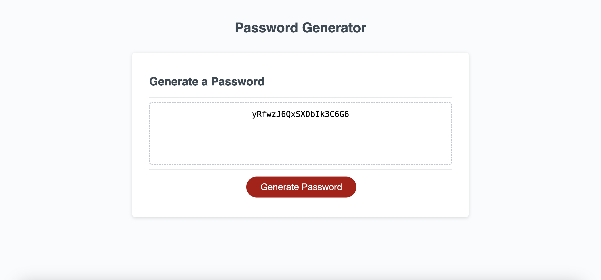

# module-5-password-generator

This week’s challenge requires you to create an application that an employee can use to generate a random password based on criteria they’ve selected by modifying starter code ᰔᩚ.*

## Description 

This simple web application generates a password based on a user's password criteria when selected. It begins by prompting users for password character length (between 8 and 128 characters) and goes on with more prompts such as numbers, special characters, lowercase etc. 

# DISCLAIMER 

HTML & CSS style sheet were provided for this project

## Acceptance Critera 

Generate a password when the button is clicked.

Present a series of prompts for password criteria:

Length of password:

At least 8 characters but no more than 128.

Character types:

Lowercase

Uppercase

Numeric

Special characters ($@%&*, etc.)

Code should validate for each input and at least one character type should be selected.

Once all prompts are answered, the password should be generated and displayed in an alert or written to the page.

## Sneak Peak Demo

## Link URL to deployed app on GitHub

https://texndo.github.io/module-5-password-generator/ 

## Link URL to GitHub repository

https://github.com/texndo/module-5-password-generator/tree/main

